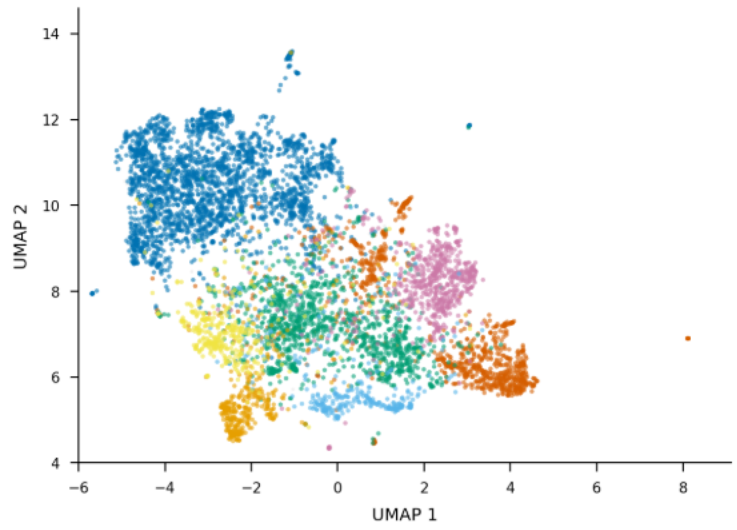
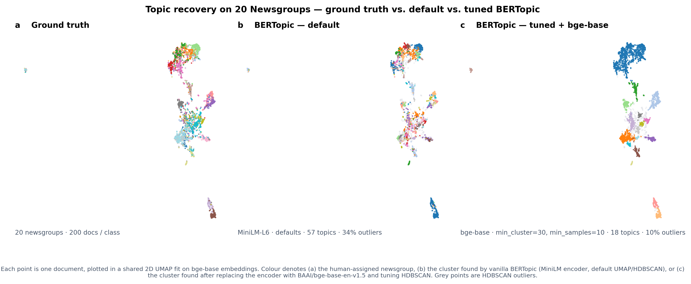

# LLMs as a reader

How to use them to extract Topics from Text

<div class="pt-8 opacity-70 text-sm">
2nd Workshop on Frontiers in Measurement and Survey Methods<br>
MeToD Project · University of Calabria · 19 May 2026
</div>

<!--
Workshop, not a research talk. Spine: two ways to bring LLMs into topic
extraction — as a component, then as the whole pipeline. Open with the
methods-transfer line (physics / CSS / ML, not economics).
-->

---
section: Motivation
---

# What this talk covers

<div class="grid grid-cols-2 gap-4 pt-4">
  <div class="agenda-card">
    <div class="agenda-num">1</div>
    <div class="agenda-title">Text → topics</div>
    <div class="agenda-sub">the measurement problem</div>
  </div>
  <div class="agenda-card">
    <div class="agenda-num">2</div>
    <div class="agenda-title">BERTopic</div>
    <div class="agenda-sub">traditional topic modelling</div>
  </div>
</div>

<div class="phase-bracket phase-traditional mt-2">Traditional</div>

<div class="grid grid-cols-3 gap-4 pt-4">
  <div class="agenda-card phase-llm">
    <div class="agenda-num">3</div>
    <div class="agenda-title">Approach 1</div>
    <div class="agenda-sub">LLM as embedding space</div>
  </div>
  <div class="agenda-card phase-llm">
    <div class="agenda-num">4</div>
    <div class="agenda-title">Approach 2</div>
    <div class="agenda-sub">LLM reads end-to-end</div>
  </div>
  <div class="agenda-card phase-llm">
    <div class="agenda-num">5</div>
    <div class="agenda-title">Validation</div>
    <div class="agenda-sub">when to use what</div>
  </div>
</div>

<div class="phase-bracket phase-llm mt-2">LLM-powered</div>

<div class="pt-6 text-center text-lg">

From **LLM as a component** to **LLM as the whole reader**.

</div>

---

# Topic modeling: from text to data

<div class="pb-3">

Raw text at scale is essentially opaque, humans can't read a million documents, and standard statistics can't summarize meaning.

</div>

```typst
#import "@preview/fletcher:0.5.7" as fletcher: diagram, node, edge

#let primary = rgb("#3333B3")
#let bright  = rgb("#6366f1")
#let soft    = rgb("#eef2ff")
#let ink     = rgb("#0f172a")
#let muted   = rgb("#64748b")
#let border  = rgb("#cbd5e1")

#html.frame(diagram(
  spacing: (32mm, 0mm),
  node-stroke: 0.9pt + border,
  node-inset: 14pt,
  node-fill: white,
  edge-stroke: 1.3pt + muted,
  mark-scale: 90%,

  node((0, 0),
    stack(spacing: 9pt,
      text(fill: bright, weight: 600, size: 0.9em, tracking: 0.08em)[CORPUS],
      text(fill: ink, size: 1.15em)[Survey responses],
      text(fill: ink, size: 1.15em)[Focus group transcript],
      text(fill: ink, size: 1.15em)[News articles],
      text(fill: ink, size: 1.15em)[Social media],
    ),
    stroke: 1.2pt + bright,
    fill: soft,
    corner-radius: 10pt,
    inset: 20pt,
  ),

  node((1, 0), text(fill: white, weight: 600, size: 1.15em)[Topic model],
    fill: bright, stroke: none, corner-radius: 8pt, inset: 18pt),

  node((2, 0), text(fill: white, weight: 600, size: 1.15em)[Topics & categories],
    fill: primary, stroke: none, corner-radius: 8pt, inset: 18pt),

  edge((0, 0), (1, 0), "->"),
  edge((1, 0), (2, 0), "->",
    label: text(fill: muted, size: 0.9em)[extract]),
))
```

<div class="pt-2 text-center max-w-4xl mx-auto">

**Topic modeling** is the task of discovering or assigning coherent, interpretable themes (*topics*) that organize a collection of documents. 

Topics may be word distributions (traditional) or named labels with descriptions (LLM-based). Either way, you get categories you can **count, compare, and reason about**.

</div>

---
hide: true
---

# A measurement problem, not a tech problem

This workshop is about *Measurement Tools Design* — so think of an LLM as an **instrument**.

<div class="grid grid-cols-3 gap-4 pt-4">
<div class="p-3 rounded bg-gray-100">

**An instrument…**

has a reading, a calibration, and an error budget.

</div>
<div class="p-3 rounded bg-gray-100">

**…we will calibrate**

validate against human coders; measure its agreement and bias.

</div>
<div class="p-3 rounded bg-gray-100">

**…with known limits**

reproducibility, prompt sensitivity, cost — stated up front.

</div>
</div>

<div class="pt-6 opacity-70">

Coming from physics / computational social science / ML — not economics. A methods transfer.

</div>

---
section: Traditional
---

# Topic modelling, two decades on

```typst
#import "@preview/fletcher:0.5.7" as fletcher: diagram, node, edge

#let primary = rgb("#0f766e")
#let bright  = rgb("#14b8a6")
#let soft    = rgb("#f0fdfa")
#let ink     = rgb("#0f172a")
#let muted   = rgb("#64748b")
#let border  = rgb("#cbd5e1")

#html.frame(diagram(
  spacing: (30mm, 6mm),
  node-stroke: none,
  node-fill: none,

  node((0, -1.3), stack(spacing: 3pt,
    text(fill: bright, weight: 600, size: 0.72em, tracking: 0.08em)[1999],
    text(fill: ink, weight: 700, size: 1.05em)[NMF],
    text(fill: muted, size: 0.72em)[matrix factorisation of \ the document–term matrix],
  )),
  node((1, -1.3), stack(spacing: 3pt,
    text(fill: bright, weight: 600, size: 0.72em, tracking: 0.08em)[2003],
    text(fill: ink, weight: 700, size: 1.05em)[LDA],
    text(fill: muted, size: 0.72em)[documents as mixtures \ of latent topics],
  )),
  node((2, -1.3), stack(spacing: 3pt,
    text(fill: bright, weight: 600, size: 0.72em, tracking: 0.08em)[2014],
    text(fill: ink, weight: 700, size: 1.05em)[STM],
    text(fill: muted, size: 0.72em)[LDA + document \ covariates],
  )),
  node((3, -1.3), stack(spacing: 3pt,
    text(fill: bright, weight: 600, size: 0.72em, tracking: 0.08em)[2022],
    text(fill: ink, weight: 700, size: 1.05em)[BERTopic],
    text(fill: muted, size: 0.72em)[embed → reduce → \ cluster → keywords],
  )),

  node((0, 0), box(width: 10pt, height: 10pt, radius: 100%, fill: primary)),
  node((1, 0), box(width: 10pt, height: 10pt, radius: 100%, fill: primary)),
  node((2, 0), box(width: 10pt, height: 10pt, radius: 100%, fill: primary)),
  node((3, 0), box(width: 10pt, height: 10pt, radius: 100%, fill: bright)),

  edge((0, 0), (1, 0), stroke: 2pt + border),
  edge((1, 0), (2, 0), stroke: 2pt + border),
  edge((2, 0), (3, 0), stroke: 2pt + border),

  edge((0, 0), (0, 2.2), "->", stroke: 1pt + bright),
  edge((1, 0), (1, 2.2), "->", stroke: 1pt + bright),
  edge((2, 0), (2, 2.2), "->", stroke: 1pt + bright),
  edge((3, 0), (3, 2.2), "->", stroke: 1pt + bright),

  node((0, 2.2),
    text(fill: primary, size: 0.8em, weight: 600)[word lists],
    stroke: 0.8pt + bright, fill: soft, corner-radius: 5pt, inset: 6pt),
  node((1, 2.2),
    text(fill: primary, size: 0.8em, weight: 600)[topic-word \ distributions],
    stroke: 0.8pt + bright, fill: soft, corner-radius: 5pt, inset: 6pt),
  node((2, 2.2),
    text(fill: primary, size: 0.8em, weight: 600)[topics + \ covariate effects],
    stroke: 0.8pt + bright, fill: soft, corner-radius: 5pt, inset: 6pt),
  node((3, 2.2),
    text(fill: primary, size: 0.8em, weight: 600)[clusters + \ keywords],
    stroke: 0.8pt + bright, fill: soft, corner-radius: 5pt, inset: 6pt),

  edge((-0.4, 3.5), (2.4, 3.5), stroke: 2pt + primary),
  edge((2.6, 3.5), (3.4, 3.5), stroke: 2pt + bright),
  node((1, 4.1), text(fill: primary, weight: 600, size: 0.72em, tracking: 0.1em)[WORD-COUNT STATISTICS]),
  node((3, 4.1), text(fill: bright, weight: 600, size: 0.72em, tracking: 0.1em)[SEMANTIC EMBEDDINGS]),
))
```

<div class="pt-6 text-center opacity-80">

Two decades of evolution: from **word-count statistics** (NMF, LDA, STM) to **semantic embeddings** (BERTopic). The representation of text itself keeps getting richer.

</div>

<div class="absolute bottom-6 left-0 right-0 text-center text-xs opacity-55 px-8">

Lee & Seung 1999 (*Nature*) · Blei, Ng & Jordan 2003 (*JMLR*) · Roberts et al. 2014 (*AJPS*) · Grootendorst 2022 (*arXiv*)

</div>

---

# How BERTopic works

BERTopic isn't one model, it's a **modular pipeline**.

```typst
#import "@preview/fletcher:0.5.7" as fletcher: diagram, node, edge

#let slate    = rgb("#e2e8f0")
#let slateInk = rgb("#334155")
#let indigo   = rgb("#4f46e5")
#let sky      = rgb("#0ea5e9")
#let teal     = rgb("#14b8a6")
#let violet   = rgb("#8b5cf6")
#let emerald  = rgb("#10b981")
#let muted    = rgb("#64748b")

#html.frame(diagram(
  spacing: (22mm, 6mm),
  node-stroke: none,
  node-fill: white,
  edge-stroke: 1.4pt + muted,
  mark-scale: 80%,

  node((0, 0), text(fill: white, weight: 700, size: 0.9em)[Embeddings],
    fill: indigo, corner-radius: 7pt, inset: 10pt),
  node((1, 0), text(fill: white, weight: 700, size: 0.9em)[Dim. \ reduction],
    fill: sky, corner-radius: 7pt, inset: 10pt),
  node((2, 0), text(fill: white, weight: 700, size: 0.9em)[Clustering],
    fill: teal, corner-radius: 7pt, inset: 10pt),
  node((3, 0), text(fill: white, weight: 700, size: 0.9em)[Tokenizer],
    fill: violet, corner-radius: 7pt, inset: 10pt),
  node((4, 0), text(fill: white, weight: 700, size: 0.9em)[Weighting \ scheme],
    fill: emerald, corner-radius: 7pt, inset: 10pt),

  edge((0, 0), (1, 0), "->"),
  edge((1, 0), (2, 0), "->"),
  edge((2, 0), (3, 0), "->"),
  edge((3, 0), (4, 0), "->"),
))
```

<div class="text-sm pt-4 space-y-1">

- **Embeddings:** Turn documents into vector representations -- [docs](https://maartengr.github.io/BERTopic/getting_started/embeddings/embeddings.html)
- **Dimensionality reduction:** Compress the embedding space (UMAP, PCA, t-SNE) -- [docs](https://maartengr.github.io/BERTopic/getting_started/dim_reduction/dim_reduction.html)
- **Clustering:** Group similar documents (HDBSCAN, k-means, BIRCH) -- [docs](https://maartengr.github.io/BERTopic/getting_started/clustering/clustering.html)
- **Tokenizer:** Split each cluster back into tokens for the weighting step -- [docs](https://maartengr.github.io/BERTopic/getting_started/vectorizers/vectorizers.html)
- **Weighting scheme:** Surface the most distinctive words per cluster (c-TF-IDF, BM25) -- [docs](https://maartengr.github.io/BERTopic/getting_started/ctfidf/ctfidf.html)

</div>

<div class="pt-3 text-center">

Every stage is swappable. Today we focus on **one stage: the embeddings**.

</div>

<div class="absolute bottom-6 left-0 right-0 text-center text-xs opacity-55 px-8">

Grootendorst 2022 (*arXiv:2203.05794*) · `maartengr.github.io/BERTopic`

</div>

---
hide: true
---
# Where traditional methods hurt

<div class="grid grid-cols-2 gap-8 pt-2">
<div>

- **You pick *K*** — the number of topics is an input, not a result
- **Bag-of-words** (LDA/NMF) — word order and context thrown away
- **Topics ≠ labels** — output is word lists you must interpret
- **Instability** — re-runs and seeds shift the topics

</div>
<div>

- **Heavy preprocessing** — stop-words, stemming, n-grams, tuning
- **Short text struggles** — tweets, one-line survey answers
- **Embeddings are only as good as the embedding model**

</div>
</div>

<div class="pt-6 text-lg">

That last point is the opening: **what if the embedding model were an LLM?**

</div>

---
section: Approach 1
---

# Two ways to bring LLMs in

<div class="flex items-center gap-3 pt-2 pb-1">
  <span class="font-bold text-sm tracking-widest" style="color: var(--accent)">Approach 1</span>
  <span class="text-xs opacity-60">LLM as a component, replace one box</span>
  <div class="flex-1 h-px" style="background: var(--accent); opacity: 0.3"></div>
</div>

```typst
#import "@preview/fletcher:0.5.7" as fletcher: diagram, node, edge

#let slate    = rgb("#e2e8f0")
#let slateInk = rgb("#334155")
#let indigo   = rgb("#4f46e5")
#let teal     = rgb("#14b8a6")
#let muted    = rgb("#64748b")
#let subtitle = rgb(255, 255, 255, 200)

#html.frame(diagram(
  spacing: (28mm, 6mm),
  node-stroke: none,
  edge-stroke: 1.4pt + muted,
  mark-scale: 80%,

  node((0, 0), text(fill: slateInk, weight: 700, size: 0.95em)[Documents],
    fill: slate, corner-radius: 7pt, inset: 11pt),

  node((1, 0),
    stack(spacing: 4pt,
      text(fill: white, weight: 700, size: 1em)[LLM],
      text(fill: subtitle, size: 0.78em)[embeddings],
    ),
    fill: indigo, corner-radius: 7pt, inset: 14pt),

  node((2, 0),
    stack(spacing: 4pt,
      text(fill: slateInk, weight: 700, size: 0.95em)[BERTopic],
      text(fill: muted, size: 0.78em)[UMAP · HDBSCAN · c-TF-IDF],
    ),
    fill: slate, corner-radius: 7pt, inset: 11pt),

  node((3, 0),
    stack(spacing: 4pt,
      text(fill: white, weight: 700, size: 0.95em)[Topics],
      text(fill: subtitle, size: 0.78em)[word lists],
    ),
    fill: teal, corner-radius: 7pt, inset: 11pt),

  edge((0, 0), (1, 0), "->"),
  edge((1, 0), (2, 0), "->"),
  edge((2, 0), (3, 0), "->"),
))
```

<div class="flex items-center gap-3 pt-4 pb-1">
  <span class="font-bold text-sm tracking-widest" style="color: var(--accent-bright)">Approach 2</span>
  <span class="text-xs opacity-60">LLM as the whole reader, replace the pipeline</span>
  <div class="flex-1 h-px" style="background: var(--accent-bright); opacity: 0.3"></div>
</div>

```typst
#import "@preview/fletcher:0.5.7" as fletcher: diagram, node, edge

#let slate        = rgb("#e2e8f0")
#let slateInk     = rgb("#334155")
#let indigoBright = rgb("#6366f1")
#let teal         = rgb("#14b8a6")
#let amber        = rgb("#fef3c7")
#let amberInk     = rgb("#92400e")
#let muted        = rgb("#64748b")
#let subtitle     = rgb(255, 255, 255, 200)

#html.frame(diagram(
  spacing: (30mm, 8mm),
  node-stroke: none,
  edge-stroke: 1.4pt + muted,
  mark-scale: 80%,

  node((0, 0), text(fill: slateInk, weight: 700, size: 0.95em)[Documents],
    fill: slate, corner-radius: 7pt, inset: 11pt),

  node((0, 1),
    stack(spacing: 3pt,
      text(fill: amberInk, weight: 700, size: 0.9em)[Codebook],
      text(fill: amberInk, size: 0.75em)[instructions / taxonomy],
    ),
    fill: amber, corner-radius: 7pt, inset: 9pt),

  node((1, 0.5),
    stack(spacing: 5pt,
      text(fill: white, weight: 700, size: 1.15em)[LLM],
      text(fill: subtitle, size: 0.82em)[reads & labels],
    ),
    fill: indigoBright, corner-radius: 9pt, inset: 20pt),

  node((2, 0.5),
    stack(spacing: 4pt,
      text(fill: white, weight: 700, size: 0.95em)[Topics],
      text(fill: subtitle, size: 0.78em)[named + described],
    ),
    fill: teal, corner-radius: 7pt, inset: 11pt),

  edge((0, 0), (1, 0.5), "->"),
  edge((0, 1), (1, 0.5), "->"),
  edge((1, 0.5), (2, 0.5), "->"),
))
```

---

# Approach 1: LLM as the embedding space

Keep BERTopic. Swap its embedding model for **LLM embeddings** — everything downstream is unchanged.

```typst
#import "@preview/fletcher:0.5.7" as fletcher: diagram, node, edge

#let slate    = rgb("#e2e8f0")
#let slateInk = rgb("#334155")
#let indigo   = rgb("#4f46e5")
#let sky      = rgb("#0ea5e9")
#let teal     = rgb("#14b8a6")
#let violet   = rgb("#8b5cf6")
#let emerald  = rgb("#10b981")
#let muted    = rgb("#64748b")
#let subtitle = rgb(255, 255, 255, 200)

#html.frame(diagram(
  spacing: (24mm, 6mm),
  node-stroke: none,
  node-fill: white,
  edge-stroke: 1.4pt + muted,
  mark-scale: 80%,

  node((0, 0),
    stack(spacing: 4pt,
      text(fill: white, weight: 700, size: 1.05em)[Embeddings],
      text(fill: subtitle, size: 0.78em)[LLM-powered],
    ),
    fill: indigo, corner-radius: 8pt, inset: 14pt),

  node((1, 0), text(fill: white, weight: 700, size: 0.9em)[Dim. \ reduction],
    fill: sky, corner-radius: 7pt, inset: 10pt),
  node((2, 0), text(fill: white, weight: 700, size: 0.9em)[Clustering],
    fill: teal, corner-radius: 7pt, inset: 10pt),
  node((3, 0), text(fill: white, weight: 700, size: 0.9em)[Tokenizer],
    fill: violet, corner-radius: 7pt, inset: 10pt),
  node((4, 0), text(fill: white, weight: 700, size: 0.9em)[Weighting \ scheme],
    fill: emerald, corner-radius: 7pt, inset: 10pt),

  edge((0, 0), (1, 0), "->"),
  edge((1, 0), (2, 0), "->"),
  edge((2, 0), (3, 0), "->"),
  edge((3, 0), (4, 0), "->"),
))
```

<div class="grid grid-cols-2 gap-6 pt-4 items-center">
<div class="text-sm">

**Embedding space:** High-dimensional map of meaning, built by a transformer pretrained on massive corpora.

Each document becomes a vector; semantic similarity becomes geometric distance, so synonyms and paraphrases cluster together, *something word-count methods could never do*.

</div>
<div>



</div>
</div>

<div class="absolute bottom-6 left-0 right-0 text-center text-xs opacity-55 px-8">

Reimers & Gurevych 2019 (*Sentence-BERT: Sentence Embeddings using Siamese BERT-Networks*, EMNLP) — the foundation of the SBERT embeddings BERTopic uses by default.

</div>

---

# Approach 1: what changes, what stays

<div class="pb-6">

LLM embeddings sharpen the **input**. Everything downstream (clustering, word lists, manual labelling) is still **classic BERTopic**.

</div>

```typst
#import "@preview/fletcher:0.5.7" as fletcher: diagram, node, edge

#let greenBg   = rgb("#ecfdf5")
#let greenLine = rgb("#a7f3d0")
#let greenInk  = rgb("#065f46")
#let greenTag  = rgb("#10b981")

#let roseBg    = rgb("#fff1f2")
#let roseLine  = rgb("#fecdd3")
#let roseInk   = rgb("#9f1239")
#let roseTag   = rgb("#f43f5e")

#let card(tagColor, bg, line, ink, tag, title, items) = block(
  width: 105mm,
  fill: bg,
  stroke: 1pt + line,
  radius: 8pt,
  inset: (x: 12pt, y: 11pt),
  stack(spacing: 8pt,
    text(fill: tagColor, weight: 700, size: 8pt, tracking: 1.4pt)[#tag],
    text(fill: ink, weight: 700, size: 12pt)[#title],
    ..items.map(it => grid(
      columns: (8pt, 1fr),
      column-gutter: 5pt,
      align: top + left,
      text(fill: tagColor, weight: 700, size: 10pt)[•],
      text(fill: ink, size: 10pt, it),
    )),
  ),
)

#html.frame(diagram(
  spacing: (4mm, 0mm),
  node-stroke: none,
  node-fill: none,

  node((0, 0), card(
    greenTag, greenBg, greenLine, greenInk, [WHAT IMPROVES],
    [Better embeddings help with],
    (
      [short, noisy text (tweets, one-liners)],
      [multilingual corpora],
      [domain-specific meaning],
      [semantic clusters, not keyword clusters],
    ),
  )),
  node((1, 0), card(
    roseTag, roseBg, roseLine, roseInk, [STILL YOUR JOB],
    [The rest of the pipeline is unchanged],
    (
      [tune UMAP / HDBSCAN, handle outliers],
      [topics still come out as *word lists*],
      [you still *read and label* them],
      [the LLM upgraded the _representation_, not the _reading_],
    ),
  )),
))
```

<div class="pt-4 text-center opacity-80">

<span style="color: var(--accent-bright); font-weight: 700">Approach 2</span> picks up exactly there: the LLM **reads**, not just **embeds**.

</div>

---

# Approach 1 in practice — load the corpus

Datasets live on the **Hugging Face Hub**. Pandas reads them directly via the `hf://` URI scheme — no download script, no caching code.

```python
import pandas as pd

splits = {"train": "train.jsonl", "test": "test.jsonl"}
df = pd.read_json(
    "hf://datasets/SetFit/20_newsgroups/" + splits["train"],
    lines=True,
)
df.head()
```

<div class="pt-2">

One line in, a tidy DataFrame out — `text`, `label`, `label_text`. The full pipeline (encode with `bge-base` → BERTopic) lives in the **companion notebook**.

</div>

<!--
Walk through the notebook live; this slide is just the data-in step.
-->

<div class="absolute bottom-6 left-0 right-0 text-center text-xs opacity-55 px-8">

Dataset: [`SetFit/20_newsgroups`](https://huggingface.co/datasets/SetFit/20_newsgroups) on Hugging Face · original corpus: Lang 1995 (*Newsweeder: Learning to filter netnews*, ICML)

</div>

---

# Vanilla BERTopic — the baseline

Two lines. No encoder choice, no UMAP/HDBSCAN tuning — BERTopic falls back to its built-in defaults.

```python
from bertopic import BERTopic

topic_model = BERTopic(verbose=True)
topics, _   = topic_model.fit_transform(docs)
topic_model.get_topic_info().head(10)
```

<div class="grid grid-cols-2 gap-6 pt-4 text-sm">
<div>

**What you get out of the box**

- encoder: `all-MiniLM-L6-v2` (22 M params, 384-d)
- dim. reduction: UMAP, `n_neighbors=15`, `n_components=5`
- clustering: HDBSCAN, `min_cluster_size=10`
- representation: c-TF-IDF on the bag of words

</div>
<div>

**Why this is the right baseline**

- it's what every BERTopic tutorial starts with
- every later improvement (LLM encoder, tuned HDBSCAN) is measured *against* this
- on 20 Newsgroups: many tiny topics, ~30 % outliers — visible in the companion notebook

</div>
</div>

<div class="absolute bottom-6 left-0 right-0 text-center text-xs opacity-55 px-8">

Grootendorst 2022 (*arXiv:2203.05794*) · [`maartengr.github.io/BERTopic`](https://maartengr.github.io/BERTopic/)

</div>

---

# Tuned BERTopic — step 1: a stronger encoder

Swap the default MiniLM for a modern LLM-grade sentence encoder. Same API, much sharper embedding space.

```python
import torch
from sentence_transformers import SentenceTransformer

device     = "cuda" if torch.cuda.is_available() else "cpu"
encoder    = SentenceTransformer("BAAI/bge-base-en-v1.5", device=device)
embeddings = encoder.encode(docs, batch_size=128, convert_to_numpy=True)
```

<div class="grid grid-cols-2 gap-6 pt-3 text-sm">
<div>

**Why this encoder**

- default `all-MiniLM-L6-v2` is the smallest SBERT (22 M, 384-d)
- `bge-base-en-v1.5` — 110 M params, 768-d, modern (2023)
- consistently strong on the MTEB leaderboard among base-sized models

</div>
<div>

**GPU notes**

- 8 GB VRAM is plenty for ~4 k docs at `batch_size=128`
- ~10–15 s end-to-end on a laptop RTX 4070
- want more quality? `bge-large-en-v1.5` (335 M, 1024-d) — same API, ~3× slower

</div>
</div>

<div class="absolute bottom-6 left-0 right-0 text-center text-xs opacity-55 px-8">

Xiao et al. 2023, *C-Pack: Packaged Resources to Advance General Chinese Embedding* (arXiv:2309.07597) · [MTEB leaderboard](https://huggingface.co/spaces/mteb/leaderboard)

</div>

---

# Tuned BERTopic — step 2: tune the clustering

Pass the embeddings into BERTopic with explicit UMAP and HDBSCAN — and lift `min_cluster_size` so HDBSCAN stops shattering each newsgroup.

```python
from umap import UMAP
from hdbscan import HDBSCAN
from bertopic import BERTopic

umap_model    = UMAP(n_neighbors=15, n_components=5, min_dist=0.0,
                     metric="cosine", random_state=42)

hdbscan_model = HDBSCAN(min_cluster_size=30, min_samples=10,
                        metric="euclidean",
                        cluster_selection_method="eom",
                        prediction_data=True)

topic_model = BERTopic(umap_model=umap_model, hdbscan_model=hdbscan_model)
topics, _   = topic_model.fit_transform(docs, embeddings=embeddings)
```

<!-- <div class="pt-4 text-center text-sm opacity-80">

Three knobs touched. Same `fit_transform` call. Next slide: what it bought us.

</div> -->

<div class="absolute bottom-6 left-0 right-0 text-center text-xs opacity-55 px-8">

[BERTopic — parameter tuning](https://maartengr.github.io/BERTopic/getting_started/parameter%20tuning/parametertuning.html) · [BERTopic FAQ — reducing outliers](https://maartengr.github.io/BERTopic/faq.html)

</div>

---

# What changed → what it bought us

Vanilla vs. tuned, on the same 4 000-doc sample of 20 Newsgroups.

<div class="pt-2 text-sm">

| | **Vanilla BERTopic** | **Tuned BERTopic** |
|---|---|---|
| **Encoder** | `all-MiniLM-L6-v2` (22 M params, 384-d) | `BAAI/bge-base-en-v1.5` (110 M params, 768-d) |
| **`min_cluster_size`** | 10 (default) | **30** — fewer micro-clusters |
| **`min_samples`** | tied to `min_cluster_size` (default) | **10** — set lower ⇒ fewer outliers |
| **UMAP** | defaults | defaults (already sensible) |
| **Topics found** | 51 | **18** — matches the 20 true classes |
| **Outliers (HDBSCAN `-1`)** | 34 % | **10 %** |
| **Visual** | fragmented over the true newsgroups | clusters trace the true classes |

</div>

<div class="pt-4 text-center text-sm opacity-80">

The encoder fixes **what gets grouped together**. The HDBSCAN knobs fix **how aggressively** it groups.

</div>

<div class="absolute bottom-6 left-0 right-0 text-center text-xs opacity-55 px-8">

Numbers from the companion notebook (`src/bertopic.ipynb`, panels **b** and **c**). Subsample: 200 docs per newsgroup × 20 newsgroups, seed 42.

</div>

---

# Vanilla vs. tuned — visualised

<div class="pt-2">



</div>

<!-- <div class="pt-3 text-center text-sm opacity-80">

Same 4 000 documents, same 2D UMAP layout. **Only the colouring changes**:
panel **a** is the truth, **b** is vanilla BERTopic (fragments + grey outliers), **c** is the tuned version (coherent regions, few outliers).

</div> -->

<div class="absolute bottom-6 left-0 right-0 text-center text-xs opacity-55 px-8">

Generated by `src/bertopic.ipynb` — shared 2D UMAP fit on `bge-base-en-v1.5` embeddings. Grey points: HDBSCAN outliers.

</div>

---
section: Approach 2
---

# Two modes of LLM topic extraction

```typst
#import "@preview/fletcher:0.5.7" as fletcher: diagram, node, edge

#let slate        = rgb("#e2e8f0")
#let slateInk     = rgb("#334155")
#let indigoBright = rgb("#6366f1")
#let teal         = rgb("#14b8a6")
#let amber        = rgb("#fef3c7")
#let amberInk     = rgb("#92400e")
#let muted        = rgb("#64748b")
#let primary      = rgb("#3333B3")
#let subtitle     = rgb(255, 255, 255, 200)

#html.frame(diagram(
  spacing: (16mm, 11mm),
  node-stroke: none,
  edge-stroke: 1.4pt + muted,
  mark-scale: 80%,

  // ── Inductive row ─────────────────────────────────────
  node((-1, 0),
    stack(spacing: 2pt,
      text(fill: primary, weight: 700, size: 0.8em, tracking: 0.12em)[INDUCTIVE],
      text(fill: muted, size: 0.7em)[discover topics],
    )),

  node((0, 0), text(fill: slateInk, weight: 700, size: 0.9em)[Documents],
    fill: slate, corner-radius: 7pt, inset: 9pt),

  node((1, 0), text(fill: white, weight: 700, size: 0.82em)[Summarize \ batch],
    fill: indigoBright, corner-radius: 7pt, inset: 8pt),

  node((2, 0), text(fill: white, weight: 700, size: 0.82em)[Update \ taxonomy],
    fill: indigoBright, corner-radius: 7pt, inset: 8pt),

  node((3, 0), text(fill: white, weight: 700, size: 0.82em)[Refine \ labels],
    fill: indigoBright, corner-radius: 7pt, inset: 8pt),

  node((4, 0),
    stack(spacing: 3pt,
      text(fill: white, weight: 700, size: 0.9em)[Taxonomy],
      text(fill: subtitle, size: 0.7em)[stable],
    ),
    fill: teal, corner-radius: 7pt, inset: 9pt),

  edge((0, 0), (1, 0), "->"),
  edge((1, 0), (2, 0), "->"),
  edge((2, 0), (3, 0), "->"),
  edge((3, 0), (4, 0), "->"),

  edge((3, 0), (1, 0), "->", bend: -40deg,
    label: text(fill: muted, size: 0.68em)[loop until stable],
    label-side: left),

  // ── Deductive row ─────────────────────────────────────
  node((-1, 2),
    stack(spacing: 2pt,
      text(fill: primary, weight: 700, size: 0.8em, tracking: 0.12em)[DEDUCTIVE],
      text(fill: muted, size: 0.7em)[assign to codebook],
    )),

  node((0, 1.6), text(fill: slateInk, weight: 700, size: 0.9em)[Documents],
    fill: slate, corner-radius: 7pt, inset: 9pt),

  node((0, 2.4),
    stack(spacing: 3pt,
      text(fill: amberInk, weight: 700, size: 0.85em)[Codebook],
      text(fill: amberInk, size: 0.7em)[fixed taxonomy],
    ),
    fill: amber, corner-radius: 7pt, inset: 8pt),

  node((2, 2),
    stack(spacing: 4pt,
      text(fill: white, weight: 700, size: 0.95em)[LLM],
      text(fill: subtitle, size: 0.75em)[reads & labels],
    ),
    fill: indigoBright, corner-radius: 8pt, inset: 12pt),

  node((4, 2),
    stack(spacing: 3pt,
      text(fill: white, weight: 700, size: 0.9em)[Assigned],
      text(fill: subtitle, size: 0.7em)[labels + quotes],
    ),
    fill: teal, corner-radius: 7pt, inset: 9pt),

  edge((0, 1.6), (2, 2), "->"),
  edge((0, 2.4), (2, 2), "->"),
  edge((2, 2), (4, 2), "->"),
))
```

**Inductive:** LLM iteratively *summarises → updates → refines* a taxonomy from the corpus. **Deductive:** classify into a scheme you already have.

<!--
TnT-LLM nuance — for Q&A and to avoid overclaiming:

Phase 1 (shown above) is *iterative*, not a single LLM call. The LLM works
through the corpus in mini-batches with three repeated operations — summarise a
batch into intermediate concepts, update the running taxonomy by merging with
existing labels, refine to prune redundancies and enforce hierarchy. The
authors frame this as analogous to SGD over a "taxonomy parameter": each pass
conditions the next, the taxonomy converges. Worth stressing on the slide
because a one-shot LLM call would not fit in context and would not be reliable.

Phase 2 (deliberately not in the diagram) — once the taxonomy is stable, the
LLM is used as a *pseudo-labeller* on a sample of the corpus to produce
training data; that data trains a *lightweight* classifier (logistic regression
on embeddings, small transformer) which then labels the full corpus at
inference time. Motivation is purely cost: LLM inference is too expensive on
millions of docs (Bing Copilot scale). The cheap classifier inherits the LLM's
labelling competence at a fraction of the cost.

Framing for this slide: we cite TnT-LLM for the *inductive-discovery paradigm*
— iterative LLM-driven taxonomy growth — not for its full two-phase
architecture. If asked, be explicit: in our pipeline we'd use the LLM-induced
taxonomy directly (or hand it to a downstream classifier of our choice); we are
borrowing the *idea* from TnT-LLM, not reproducing the framework.
-->

<div class="absolute bottom-6 left-0 right-0 text-center text-xs opacity-55 px-8">

Inductive paradigm exemplified by: Wan et al. 2024, *TnT-LLM: Text Mining at Scale with LLMs* ([arXiv:2403.12173](https://arxiv.org/abs/2403.12173)) · Deductive: Pham et al. 2024, *TopicGPT*, NAACL([aclanthology.org/2024.naacl-long.164](https://aclanthology.org/2024.naacl-long.164/))

</div>

---

# The prompt *is* your codebook

Brief the model like a research assistant — start with the role, the task, and the codebook itself.

```text
[Role]   You are coding documents about <domain>.

[Task]   Identify the topic(s) each document covers.
         Use a topic from the list below when one fits.
         If none of them does, propose a new one.

[Topics so far]
  - price_concerns: cost, affordability, value for money
  - reliability:    breakdowns, durability, trust in the product
  - ...
```

Half of a good prompt is just being **explicit about what counts as a topic**. The list isn't decoration — it *is* your measurement instrument.

---

# Anchor it with examples and rules

Definitions drift. Examples and bounded rules are what actually pin the model's behavior.

```text
[Examples]
  Doc: "way too expensive for a small battery"
   → price_concerns                                       (existing)
  Doc: "battery died in two months, warranty wouldn't cover it"
   → warranty: claims, coverage, support after purchase   (new)

[Rules]
  1. topics must be GENERAL, not document-specific
  2. each topic captures a SINGLE idea, not a combination
  3. new topics need a short label + one-line description
  4. if nothing relevant is covered, return "None"

[Document]
  {document}
```

A good prompt is **explicit, exemplified, and bounded** — and gives the model a way out when the codebook doesn't cover what's in front of it.

<div class="absolute bottom-6 left-0 right-0 text-center text-xs opacity-55 px-8">

Structure adapted from Pham et al. 2024, *TopicGPT*, NAACL — `generate_topic` / `assign_topics` prompt templates ([aclanthology.org/2024.naacl-long.164](https://aclanthology.org/2024.naacl-long.164/))

</div>

---

# Make the output structured

Free text is unparseable and irreproducible. Pin a schema — every field should carry weight.

```json
{
  "doc_id": "R0427",
  "topics": [
    {
      "label": "price_concerns",
      "source_quote": "way too expensive for a small battery",
      "clarity": 4,
      "rationale": "explicit cost-vs-value complaint, literal mention"
    },
    {
      "label": "reliability",
      "source_quote": "friend's one broke after a year",
      "clarity": 2,
      "rationale": "second-hand report, no time frame given"
    }
  ]
}
```

Not just a label dump — a record you can **audit, validate, and aggregate** downstream.

---

# What makes the schema load-bearing

Each field on the previous slide is there for a reason.

- **Pin it with the API** — JSON mode / function calling / structured-output; *validate* every record before downstream code touches it
- **Ground every label in a literal `source_quote`** copied from the document — auditability, and the model can't invent claims
- **Score on a small ordinal scale** (e.g. 1–4) instead of free-form confidence — different models and temperatures actually agree
- **Require a one-line `rationale`** in-band — improves the score and gives you debug context for free

Plus: in the system message, tell the model *"respond with valid JSON only, be terse, no commentary"* — verbosity is the #1 reason structured-output pipelines fail.

<div class="absolute bottom-6 left-0 right-0 text-center text-xs opacity-55 px-8">

Schema pattern adapted from Riehl, Marin et al. 2026, *ARA: Agentic Reproducibility Assessment* — schema-constrained JSON grounded in literal source quotes, ordinal scoring with rationales ([arXiv:2605.02651](https://arxiv.org/abs/2605.02651))

</div>

---
hide: true
---

# Long documents: chunk, then merge

LLMs have a context limit — split, process, recombine.

```typst
#import "@preview/fletcher:0.5.7" as fletcher: diagram, node, edge

#html.frame(diagram(
  spacing: (11mm, 6mm),
  node-stroke: 0.5pt,
  node((0,1), [Long \ document]),
  node((2,0), [Chunk 1]),
  node((2,1), [Chunk 2]),
  node((2,2), [Chunk 3]),
  node((4,0), [LLM], fill: blue.lighten(80%)),
  node((4,1), [LLM], fill: blue.lighten(80%)),
  node((4,2), [LLM], fill: blue.lighten(80%)),
  node((6,1), [Merge & \ de-duplicate], fill: green.lighten(80%)),
  edge((0,1), (2,0), "->"),
  edge((0,1), (2,1), "->"),
  edge((0,1), (2,2), "->"),
  edge((2,0), (4,0), "->"),
  edge((2,1), (4,1), "->"),
  edge((2,2), (4,2), "->"),
  edge((4,0), (6,1), "->"),
  edge((4,1), (6,1), "->"),
  edge((4,2), (6,1), "->"),
))
```

Mind chunk boundaries — don't split mid-argument.

---

# Settings that matter

Four knobs that turn LLM-coding from a *thing that happened* into a *method*.

```typst
#import "@preview/fletcher:0.5.7" as fletcher: diagram, node

#let card(bg, line, accent, ink, header, title, body) = block(
  width: 95mm,
  fill: bg,
  stroke: 1pt + line,
  radius: 8pt,
  inset: 13pt,
  stack(spacing: 7pt,
    text(fill: accent, weight: 700, size: 7pt, tracking: 1.4pt)[#header],
    text(fill: ink, weight: 700, size: 12pt)[#title],
    text(fill: ink, size: 9pt, body),
  ),
)

#html.frame(diagram(
  spacing: (5mm, 5mm),
  node-stroke: none,
  node-fill: none,

  node((0, 0), card(
    rgb("#eef2ff"), rgb("#c7d2fe"), rgb("#4f46e5"), rgb("#1e1b4b"),
    [01 · PROMPT], [Few-shot examples],
    [A handful of labelled cases in the prompt anchors the codebook far better than definitions alone.]
  )),
  node((1, 0), card(
    rgb("#f0f9ff"), rgb("#bae6fd"), rgb("#0284c7"), rgb("#0c4a6e"),
    [02 · DECODING], [Temperature],
    [Use 0 (or near-0) for coding tasks — you want consistency, not creativity.]
  )),
  node((0, 1), card(
    rgb("#f0fdfa"), rgb("#99f6e4"), rgb("#0d9488"), rgb("#134e4a"),
    [03 · MODEL], [Model choice],
    [Bigger isn't always better. Test a cheap model first, escalate only if agreement is poor.]
  )),
  node((1, 1), card(
    rgb("#fffbeb"), rgb("#fde68a"), rgb("#b45309"), rgb("#78350f"),
    [04 · METHOD], [Pin everything],
    [Model name, version/date, prompt, temperature — these *are* your method.]
  )),
))
```

---

# A ready framework: TopicGPT

`TopicGPT` (Pham et al., NAACL 2024) — a prompt-based pipeline that produces a **two-level topic hierarchy** and grounds every assignment in a **supporting quote**.

```typst
#import "@preview/fletcher:0.5.7" as fletcher: diagram, node, edge

#let indigo   = rgb("#4f46e5")
#let sky      = rgb("#0ea5e9")
#let teal     = rgb("#14b8a6")
#let emerald  = rgb("#10b981")
#let muted    = rgb("#64748b")
#let subtitle = rgb(255, 255, 255, 200)

#html.frame(diagram(
  spacing: (22mm, 6mm),
  node-stroke: none,
  edge-stroke: 1.4pt + muted,
  mark-scale: 80%,

  node((0, 0),
    stack(spacing: 4pt,
      text(fill: white, weight: 700, size: 0.95em)[Generate],
      text(fill: subtitle, size: 0.78em)[L1 → L2 topics],
    ),
    fill: indigo, corner-radius: 7pt, inset: 11pt),

  node((1, 0),
    stack(spacing: 4pt,
      text(fill: white, weight: 700, size: 0.95em)[Refine],
      text(fill: subtitle, size: 0.78em)[merge / drop],
    ),
    fill: sky, corner-radius: 7pt, inset: 11pt),

  node((2, 0),
    stack(spacing: 4pt,
      text(fill: white, weight: 700, size: 0.95em)[Assign],
      text(fill: subtitle, size: 0.78em)[topic + quote],
    ),
    fill: teal, corner-radius: 7pt, inset: 11pt),

  node((3, 0),
    stack(spacing: 4pt,
      text(fill: white, weight: 700, size: 0.95em)[Correct],
      text(fill: subtitle, size: 0.78em)[re-ground in list],
    ),
    fill: emerald, corner-radius: 7pt, inset: 11pt),

  edge((0, 0), (1, 0), "->"),
  edge((1, 0), (2, 0), "->"),
  edge((2, 0), (3, 0), "->"),
))
```

<div class="grid grid-cols-2 gap-6 pt-4 text-sm">
<div>

**What you get out**
- two-level hierarchy: high-level topics → subtopics
- every label paired with a **supporting quote** from the document
- topic list is editable — refine without retraining
- runs on OpenAI · Gemini · Azure · or any open model via vLLM

</div>
<div>

**How it scored**
- harmonic mean purity **0.74** vs. **0.64** for the strongest baseline, on human-annotated Wikipedia topics
- evaluated on **Wikipedia** and **Congressional Bills**
- also reports Adjusted Rand Index and NMI

</div>
</div>

<div class="absolute bottom-6 left-0 right-0 text-center text-xs opacity-55 px-8">

Pham et al. 2024, *TopicGPT: A Prompt-based Topic Modeling Framework*, NAACL — [`aclanthology.org/2024.naacl-long.164`](https://aclanthology.org/2024.naacl-long.164/) · code: [`github.com/chtmp223/topicGPT`](https://github.com/chtmp223/topicGPT)

</div>

---
section: Validation
---

# Does it work? Treat the LLM as a coder

Validate it exactly as you would validate a human research assistant.

```typst
#import "@preview/fletcher:0.5.7" as fletcher: diagram, node, edge

#let slate        = rgb("#e2e8f0")
#let slateInk     = rgb("#334155")
#let indigoBright = rgb("#6366f1")
#let teal         = rgb("#14b8a6")
#let amber        = rgb("#fef3c7")
#let amberInk     = rgb("#92400e")
#let muted        = rgb("#64748b")
#let subtitle     = rgb(255, 255, 255, 200)

#html.frame(diagram(
  spacing: (34mm, 11mm),
  node-stroke: none,
  edge-stroke: 1.4pt + muted,
  mark-scale: 80%,

  node((0, 1),
    stack(spacing: 3pt,
      text(fill: slateInk, weight: 700, size: 0.9em)[Sample of documents],
      text(fill: muted, size: 0.72em)[hand-picked subset],
    ),
    fill: slate, corner-radius: 7pt, inset: 11pt),

  node((1, 0),
    stack(spacing: 3pt,
      text(fill: amberInk, weight: 700, size: 0.9em)[Human coder],
      text(fill: amberInk, size: 0.72em)[gold standard],
    ),
    fill: amber, corner-radius: 7pt, inset: 11pt),

  node((1, 2),
    stack(spacing: 4pt,
      text(fill: white, weight: 700, size: 0.9em)[LLM coder],
      text(fill: subtitle, size: 0.72em)[instrument under test],
    ),
    fill: indigoBright, corner-radius: 7pt, inset: 11pt),

  node((2, 1),
    stack(spacing: 4pt,
      text(fill: white, weight: 700, size: 0.9em)[Agreement],
      text(fill: subtitle, size: 0.72em)[κ · F1 · confusion matrix],
    ),
    fill: teal, corner-radius: 7pt, inset: 11pt),

  edge((0, 1), (1, 0), "->"),
  edge((0, 1), (1, 2), "->"),
  edge((1, 0), (2, 1), "->"),
  edge((1, 2), (2, 1), "->"),
))
```

Hand-code a subset, compare, report agreement — same logic as inter-rater reliability.

---

# The honest caveats

<div class="grid grid-cols-2 gap-8 pt-2">
<div>

- **Reproducibility** — Approach 1 inherits BERTopic's; Approach 2 needs care: pin model, version, prompt, temperature
- **Prompt sensitivity** — wording shifts results; run a robustness check
- **Hallucinated topics** — constrain with a taxonomy; flag low confidence

</div>
<div>

- **Systematic bias** — does coding differ across respondent subgroups?
- **Measurement error** — topic labels used as variables → attenuation / bias downstream
- **Cost & access** — embedding vs. per-token cost; open vs. closed models

</div>
</div>

<div class="pt-5 opacity-80">

Stating the error budget is what makes it a *measurement* method.

</div>

---
section: Wrap-up
---

# When to use what

<div class="text-sm leading-tight">

| | Traditional BERTopic | Approach 1 — + LLM embeddings | Approach 2 — LLM only |
|---|---|---|---|
| Short / noisy / multilingual text | weak | strong | strong |
| Output | word lists | word lists | named + described |
| You still label by hand | yes | yes | no |
| Reproducibility | high | high-ish | needs care |
| Cost | low | embedding API | per-token API |
| Discovery vs. codebook | discovery | discovery | both |

</div>

<div class="pt-3 text-lg">

Often the answer: **Approach 1 to explore, Approach 2 to read.**

</div>

---

# Resources to take home

<div class="grid grid-cols-2 gap-6 pt-2 text-sm">
<div>

**Methods used in this deck**
- *Topic models:* Blei, Ng & Jordan (2003) *LDA*, JMLR · Roberts, Stewart, Tingley et al. (2014) *STM*, AJPS · Grootendorst (2022) *BERTopic* — [`maartengr.github.io/BERTopic`](https://maartengr.github.io/BERTopic/)
- *Embeddings:* Reimers & Gurevych (2019) *Sentence-BERT*, EMNLP · Xiao et al. (2023) *bge / C-Pack* — [MTEB leaderboard](https://huggingface.co/spaces/mteb/leaderboard)

**LLM-driven topic extraction**
- Wan et al. (2024) *TnT-LLM: Text Mining at Scale with LLMs* — [`arXiv:2403.12173`](https://arxiv.org/abs/2403.12173)
- Pham et al. (2024) *TopicGPT*, NAACL — [`aclanthology.org/2024.naacl-long.164`](https://aclanthology.org/2024.naacl-long.164/) · [`github.com/chtmp223/topicGPT`](https://github.com/chtmp223/topicGPT)

**Structured output as measurement**
- Riehl, Marin et al. (2026) *ARA: Agentic Reproducibility Assessment* — [`arXiv:2605.02651`](https://arxiv.org/abs/2605.02651)

</div>
<div>

**Validation & rigour**
- *LLMs as annotators:* Gilardi et al. (2023) *ChatGPT outperforms crowd workers…*, PNAS · Ziems et al. (2024) *Can LLMs Transform Computational Social Science?*, Comp. Linguistics
- *Design-based inference from LLM labels:* Egami et al., *Design-Based Semi-Supervised Learning*
- *Open-source & reproducibility:* Spirling (2023) *Open-source generative AI for science*, Nature

**Companion materials**
- Walkthrough notebook: `src/bertopic.ipynb` — vanilla + tuned BERTopic on 20 Newsgroups, generates the comparison panel on slide 14
- Deck + code: [`github.com/AndresLaverdeMarin/llm-topic-extraction`](https://github.com/AndresLaverdeMarin/llm-topic-extraction)
- Dataset: [`SetFit/20_newsgroups`](https://huggingface.co/datasets/SetFit/20_newsgroups) on Hugging Face

</div>
</div>

---
layout: center
class: text-center
---

# Thank you

From **LLM as a component** to **LLM as the whole reader** — a calibratable instrument for turning text into topics.

<div class="pt-6 opacity-70">
Andres L. Marin · andres.laverde-marin@ec.europa.eu<br>
Slides & notebook: <span class="opacity-60">github.com/AndresLaverdeMarin/llm-topic-extraction</span>
</div>
